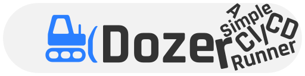
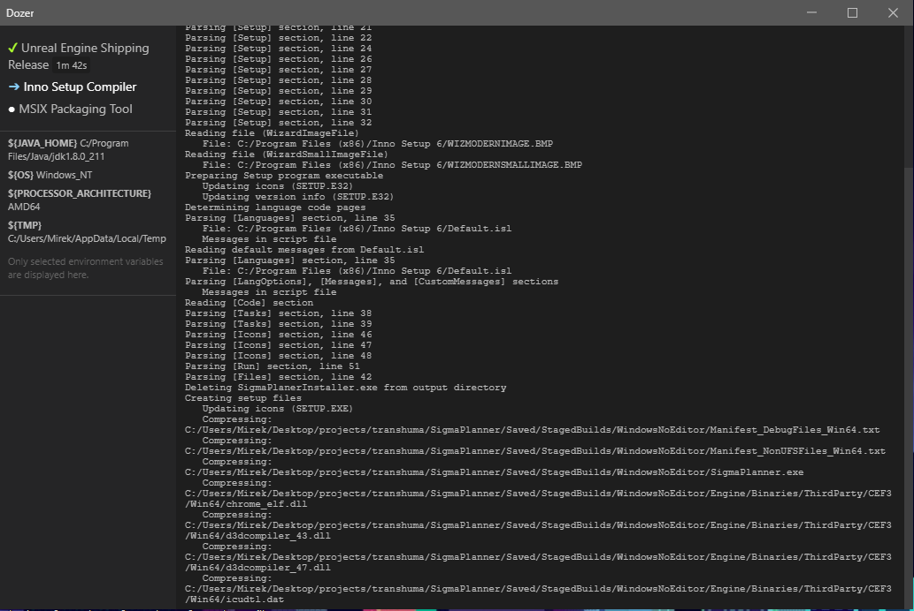

> Dozer, a simple continuous integration / deployment / delivery / task runner (CI/CD).

Useful if:
- You don't have your own server existing cloud CI/CD options seem like overkill.
- Existing cloud CI/CD options are not suitable for some reason (e.g. too hardware demanding runs).
- You want to use command line tools that are hard to install on cloud runners.
- Your environment is already set up and you want to save time installing all tools on each CI/CD run.
- You want to develop and test your CI/CD steps on your localhost before uploading the scripts to a cloud CI/CD.

The GUI is optional. Dozer can be also run on servers.



# Quick Start

## Install

0. If you have Dozer 3 or earlier installed, uninstall it first (find Dozer in the *Apps & Features* settings dialog, click it and select Uninstall).
1. Download a release archive for your platform from the [Releases page](https://github.com/kasp1/Dozer/releases) and unzip it to a safe folder.
2. Add that folder to your PATH.
    - [How to add to PATH on Windows](https://learn.microsoft.com/en-us/previous-versions/office/developer/sharepoint-2010/ee537574(v=office.14)) 
    - [How to add to PATH on Linux](https://linuxize.com/post/how-to-add-directory-to-path-in-linux/)
    - [How to add to PATH on MacOS](https://www.architectryan.com/2012/10/02/add-to-the-path-on-mac-os-x-mountain-lion/)

## Create CI/CD workflow

And save it as a YAML file in your project's directory, for example, **ci.yaml**:

```yaml
runtimeDirectory: C:/somewhere # optional, default: current working directory

steps:
- title: Print Node Version # any display name
  command: node -v # CLI command to run

- title: Another step
  workingDirectory: C:/Program Files/Java/jdk1.8.0_211/bin
  skippable: true # the execution will continue on failure of this step
  command: java.exe
    -version # can be multi-line

- title: Downloaded Script # This step automatically downloads the linked code and saves it under the temporary directory.
  command: node ${TMP}/delayed.js 5
  code: https://raw.githubusercontent.com/kasp1/Dozer/v4/examples/dev/delayed.js
```

## Run Dozer

Then in your project's directory, run the following command:

```bash
dozer ci.yaml # [--gui|--webui|--no-api]
```

## Command line arguments

- `--gui` opens a native user interface window by running the `dozerui` command.
- `--gui <command|path>` opens a native user interface window with the specified command or path to binary.
- `--webui` starts an internal web server and opens the web user interface in a browser tab.
- `--webui-port` defines the port for the internal web user interface server to start on, `8221` by default.
- `--webui <url>` will open an external web user interface by the specified URL in a browser tab, won't start an internal web server.
- `--no-api` disables the Websockets API, no UI will be able to connect and display the progress and outputs.
- `--api-port <number>` changes the port that the user interfaces should connect to, `8220` by default.
- `--root <dir>` changes the starting working directory. Overrides the YAML `runtimeDirectory` option. Both `\` and `/` can be specified as path separators.

> Warning: it is a bad practice and a security risk to have your pipeline steps output sensitive data. If you don't specify the `--no-api` argument while running Dozer, and if the machine's IP is public, anyone in the world can connect to the Dozer runner and see the output logs. For ease of use, Dozer will open the UI API by default.

## Create custom steps

Dozer steps don't need to be written in any particular language. Create an executable script/binary in your favorite programming language. Test it with regular command line calls, then add it as a Dozer step in a similar manner.

## Set environment variables from Dozer steps

Sometimes you need to pass data from one step to another. With Dozer, you would set an environment variable by outputting a regular standard output line with the syntax `##varName=value#`.

Node.js:
```js
console.log('##NEXT_VERSION=1.0.1#')
```

Python:
```python
print('##NEXT_VERSION=1.0.1#')
```

PHP:
```php
print '##NEXT_VERSION=1.0.1#';
```

Dart:
```dart
print('##NEXT_VERSION=1.0.1#');
```

Please note that `##` cannot be prepended with another output on the same line.

## Read environment variables in Dozer steps

All environment variables, including the ones you set in the previous steps, are obtained the standard way for your language of choice.

Node.js
```js
process.env['NEXT_VERSION']
```

Python
```python
import os
print(os.environ['NEXT_VERSION'])
```

PHP
```php
getenv('NEXT_VERSION');
```

Dart
```dart
import 'dart:io';
Platform.environment['NEXT_VERSION']
```

# Install Dozer

[Get the latest release](https://github.com/kasp1/Dozer/releases/) and run it as an Administrator.

# Cookbook

## Set semantic-release version to CI_VERSION

Assuming you have semantic-release set up for your project, add the following `semantic-release-env-version` plugin to your semantic-release configuration, e.g:

```json
"release": {
  "plugins": [
    "@semantic-release/commit-analyzer",
    "@semantic-release/release-notes-generator",
    "@semantic-release/changelog",
    [ "./semantic-release-env-version.js", {
      "varName": "CI_VERSION",
      "setOnlyOnRelease": false
    }]
  ]
}
```

Don't forget to update the path to the plugin's file `semantic-release-env-version.js`, which should contain the following code:

```js
const { spawnSync } = require("child_process")

function setDozerCiVersion(varName, version) {
  version = version || '1.0.0' // 1.0.0 if there is no tag history in the repo

  varName = varName || 'CI_VERSION'
  console.log(`##${varName}=${version}#`)
} 

let mod = {
  async analyzeCommits (pluginConfig, { lastRelease: { version }, logger }) {
    const setOnlyOnRelease = pluginConfig.setOnlyOnRelease === undefined ? true : !!pluginConfig.setOnlyOnRelease
  
    if (!setOnlyOnRelease) {
      setDozerCiVersion(pluginConfig.varName, version)
    }
  },

  async prepare (pluginConfig, { nextRelease: { version }, logger }) {
    setDozerCiVersion(pluginConfig.varName, version)
  }
}

module.exports = mod
```

Step to run semantic release:

```yaml
steps:
- displayName: 'Semantic Release'
  comand: npx semantic-release --no-ci
```

# Trouble?

Discord: [https://discord.gg/JJDxmpVT6v](https://discord.gg/JJDxmpVT6v)

# Contribute

## Dozer Runner

### Setup

0. Make sure you have [Node.js](https://nodejs.org) installed.
1. Clone the repository.
2. In a terminal, change to the `runner` directory.
3. Run `npm i` to install dependencies.

### Develop

The source code of the *runner* is in the `runner` folder. Each time you want to test, execute `node runner/main.js ci.yaml` the same way as you would execute `dozer ci.yaml`.

The `examples/dev` contains a few pipelines handy for development.

Before using the `--webui` argument, you need to make sure the *Web UI* is built under `dist/webui` (please see how to build it below). Alternatively, you can specify another webui directory for *Dozer Runner* to serve the *Web UI* files from by setting the `DOZER_DEV_WEBUI_DIR` to a directory containing the files (e.g. in the existing Dozer installation in your system). Another alternative would be specifying the URL to a third-party *Web UI* page, e.g. `--webui http://localhost:8080/#localhost:8220`, which won't start the *Web UI* file server but will just open a browser tab for you.

Before using `--gui`, you need to make sure the `dozerui` command exists on your system. If the command is not present in your system `PATH` environment variable, you can specify a direct path to the *Native UI* binary as `--gui path/to/binary`. The same way you can also guide the *Dozer Runner* to start any other command present on your system, e.g. `--gui customui`.

## Dozer WebUI

### Setup

0. Make sure you have [Node.js](https://nodejs.org) and [Vue CLI](https://cli.vuejs.org/) installed.
1. Clone the repository.
2. In a terminal, change to the `webui` directory.
3. Run `npm i` to install dependencies.

### Develop

The source code of the *WebUI* is in the `webui` folder. Each time you want to test, execute `node run serve`, which will make the Vue CLI open the *WebUI* in a browser window in a hot-reload mode.

### Build

In the `webui` folder, execute `node run serve`. The built files should appear under `../dist/webui`.

## Websockets API

Unless the `--no-api` command line argument is specified on the *Dozer Runner*, it will open the Websockets API for any custom UI or scripts to connect and get information about the pipeline's progress.

The communication messages are *stringified* JSONs. Any newly connected client will automatically receive the `recap` message, which contains the list of pipeline steps and their *up-to-date* statuses and logs, and environment variables before and after their execution. Afterward, there will be automatically coming messages when a step will change its status when a step has a new output and periodic updates about environment variables (between each step).

If the incoming message contains the `{ "recap": ... }` key, it will contain information about each step in the pipeline and its *up-to-date* history.

If the incoming message contains `{ "step": ..., "output": ... }` keys, it will contain a new `output` content to be attached to the output history of the specified `step`.

In the event of a step finishing, a message will arrive containing the `{ "step": ..., "status": ..., "totalTime": ..., "vars": ...  }` keys. If total `totalTime` is present, it is the time that the step took to execute in milliseconds.