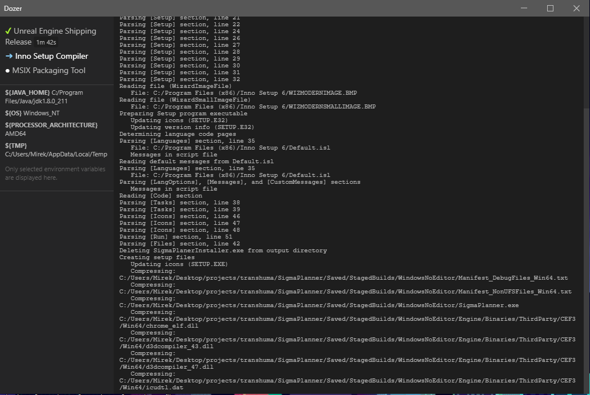

# Dozer Simple CI/CD Runner

> Simple continuous integration runner.

Useful if:
- You don't have your own server existing cloud CI/CD options seem like overkill.
- Existing cloud CI/CD options are not suitable for some reason (e.g. too hardware demanding runs).
- You want to use command line tools that are hard to install over command line.
- Your environment is already set up and you want to save time installing all tools on each CI/CD run.
- You want to develop and test your CI/CD steps on your localhost before uploading the scripts to a cloud CI/CD.

The GUI window is optional.



# Quick Start

## Create CI/CD workflow 

And save it as a YAML file in your project's directory, for example, **ci.yaml**:

```yaml
runtimeDirectory: C:/somewhere # optional, default: current working directory

steps:
- displayName: Print Node Version # any display name
  command: node -v # CLI command to run

- displayName: Another step
  workingDirectory: C:/Program Files/Java/jdk1.8.0_211/bin
  skippable: true # the execution will continue on failure of this step
  command: java.exe
    -version # can be multi-line

- displayName: Gist Step # This step automatically downloads the linked code and saves it under the temporary directory.
  command: node ${TMP}/dozer-create-CI_NODE_VERSION.js
  code: https://gist.githubusercontent.com/kasp1/9efbc3afc32783d34a903aebe1d3b734/raw/56ae650b3e80db7c5072af67965f94587158b243/dozer-create-CI_NODE_VERSION.js
```

## Run Dozer

Then in your project's directory, run the following command:

```bash
dozer ci.yaml # --gui
```

Remove the hash if you want Dozer to display the GUI as well.

## Command line arguments

- `--gui` opens the user interface.
- `--root <dir>` changes the starting working directory. Overrides the YAML `runtimeDirectory` option. Both \ and / can be specified as path separators.

## Create custom steps

Dozer steps don't need to be written in any particular language. Create an executable script/binary in your favorite programming language. Test it with regular command line calls, then add it as a Dozer step in a similar manner.

## Set environment variables from Dozer steps

Sometimes you need to pass data from one step to another. With Dozer, you would set an environment variable by outputting a regular standard output line with the syntax `##varName=value#`.

Node.js:
```js
console.log('##NEXT_VERSION=1.0.1#')
```

Python:
```python
print('##NEXT_VERSION=1.0.1#')
```

PHP:
```php
print '##NEXT_VERSION=1.0.1#';
```

Dart:
```dart
print('##NEXT_VERSION=1.0.1#');
```

Please note that `##` cannot be prepended with another output on the same line.

## Read environment variables in Dozer steps

All environment variables, including the ones you set in the previous steps, are obtained the standard way for your language of choice.

Node.js
```js
process.env['NEXT_VERSION']
```

Python
```python
import os
print(os.environ['NEXT_VERSION'])
```

PHP
```php
getenv('NEXT_VERSION');
```

Dart
```dart
import 'dart:io';
Platform.environment['NEXT_VERSION']
```

# Install Dozer

[Get the latest release](https://github.com/kasp1/Dozer/releases/) and run it as an Administrator.

# Cookbook

## Set semantic-release version to CI_VERSION

Assuming you have semantic-release set up for your project, add the following `semantic-release-env-version` plugin to your semantic-release configuration, e.g:

```json
"release": {
  "plugins": [
    "@semantic-release/commit-analyzer",
    "@semantic-release/release-notes-generator",
    "@semantic-release/changelog",
    [ "./semantic-release-env-version.js", {
      "varName": "CI_VERSION",
      "setOnlyOnRelease": false
    }]
  ]
}
```

Don't forget to update the path to the plugin's file `semantic-release-env-version.js`, which should contain the following code:

```js
const { spawnSync } = require("child_process")

function setDozerCiVersion(varName, version) {
  version = version || '1.0.0' // 1.0.0 if there is no tag history in the repo

  varName = varName || 'CI_VERSION'
  console.log(`##${varName}=${version}#`)
} 

let mod = {
  async analyzeCommits (pluginConfig, { lastRelease: { version }, logger }) {
    const setOnlyOnRelease = pluginConfig.setOnlyOnRelease === undefined ? true : !!pluginConfig.setOnlyOnRelease
  
    if (!setOnlyOnRelease) {
      setDozerCiVersion(pluginConfig.varName, version)
    }
  },

  async prepare (pluginConfig, { nextRelease: { version }, logger }) {
    setDozerCiVersion(pluginConfig.varName, version)
  }
}

module.exports = mod
```

Step to run semantic release:

```yaml
steps:
- displayName: 'Semantic Release'
  comand: npx semantic-release --no-ci
```

# Trouble?

Discord: (https://discord.gg/JJDxmpVT6v)[https://discord.gg/JJDxmpVT6v]

# Contribute

## Build Setup

``` bash
# install dependencies
npm install

# serve with hot reload at localhost:9080
npm run dev

# build electron application for production
npm run build


# lint all JS/Vue component files in `src/`
npm run lint

```

While debugging with npm, command line options can be added after `--`, e.g.:

``` bash
npm run dev -- ci.yaml --gui --root C:\rootdir
```

---

This project was generated with [electron-vue](https://github.com/SimulatedGREG/electron-vue)@[45a3e22](https://github.com/SimulatedGREG/electron-vue/tree/45a3e224e7bb8fc71909021ccfdcfec0f461f634) using [vue-cli](https://github.com/vuejs/vue-cli). Documentation about the original structure can be found [here](https://simulatedgreg.gitbooks.io/electron-vue/content/index.html).
