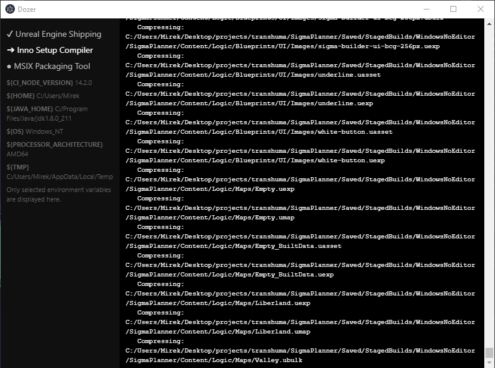

# Dozer Simple CI/CD Runner

> Simple continuous integration runner.

Useful if:
- You don't have your own server existing cloud CI/CD options seem like an overkill.
- Existing cloud CI/CD options are not suitable for some reason (e.g. too hardware demanding runs).
- You want to use command line tools that are hard to install over command line.
- Your environment is already set up and you want save time installing all tools on each CI/CD runs.
- You want to develop and test your CI/CD steps on your localhost before uploading the scripts to a cloud CI/CD.

[](https://www.buymeacoffee.com/transhuma)

The GUI window is optional.



## Quick Start

### Create CI/CD workflow 

And save it as a YAML file in your project's directory, for example **ci.yaml**:

```yaml
runtimeDirectory: C:/somewhere # optional, default: current workding directory

steps:
- displayName: 'Print Node Version' # any display name
  exec: node # path to the executable, try absolute path if things get screwed
  args:
    - -v

- displayName: 'Another step'
  exec: C:/Program Files/Java/jdk1.8.0_211/bin/java.exe
  args:
    - -version

- displayName: 'Gist Step' # This step automatically downloads the mentioned code and saves it under the temporary directory.
  exec: node
  code: https://gist.githubusercontent.com/kasp1/9efbc3afc32783d34a903aebe1d3b734/raw/56ae650b3e80db7c5072af67965f94587158b243/bulldozer-create-CI_NODE_VERSION.js
  args:
    - ${TMP}/bulldozer-create-CI_NODE_VERSION.js
```

### Run Dozer

Then in your project's directory, run the following command:

```bash
dozer ci.yaml # --gui
```

Remove the hash if you want Dozer to display the GUI as well.

## Install Dozer

[Get the latest release](https://github.com/kasp1/Dozer/releases/) and run it as an Administrator.

## Support

Create issues or send email to k@e0.cz

## Contribute

Clone the repository and change the line `120` at `.electron-vue/dev-runner.js` to your test YAML file.

#### Build Setup

``` bash
# install dependencies
npm install

# serve with hot reload at localhost:9080
npm run dev

# build electron application for production
npm run build


# lint all JS/Vue component files in `src/`
npm run lint

```

---

This project was generated with [electron-vue](https://github.com/SimulatedGREG/electron-vue)@[45a3e22](https://github.com/SimulatedGREG/electron-vue/tree/45a3e224e7bb8fc71909021ccfdcfec0f461f634) using [vue-cli](https://github.com/vuejs/vue-cli). Documentation about the original structure can be found [here](https://simulatedgreg.gitbooks.io/electron-vue/content/index.html).
